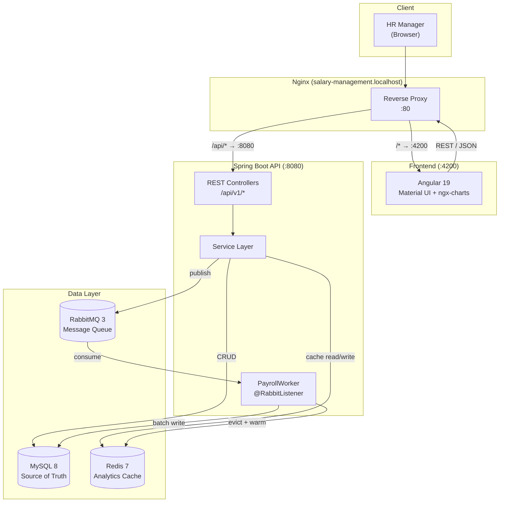
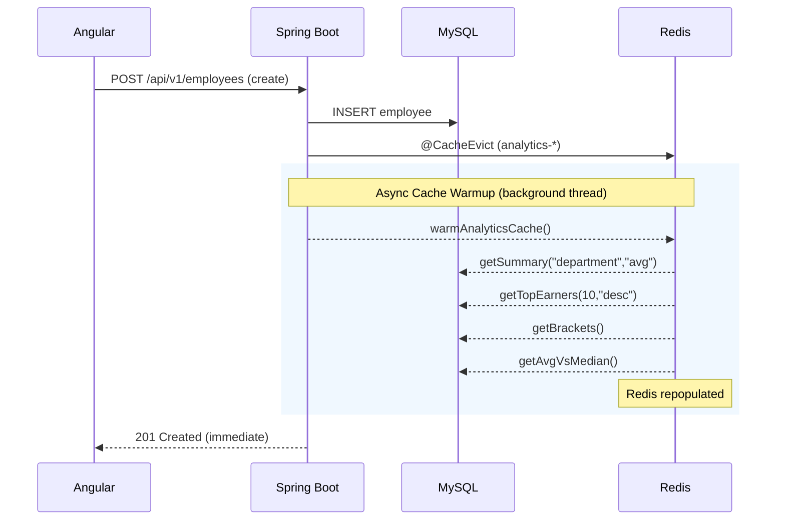
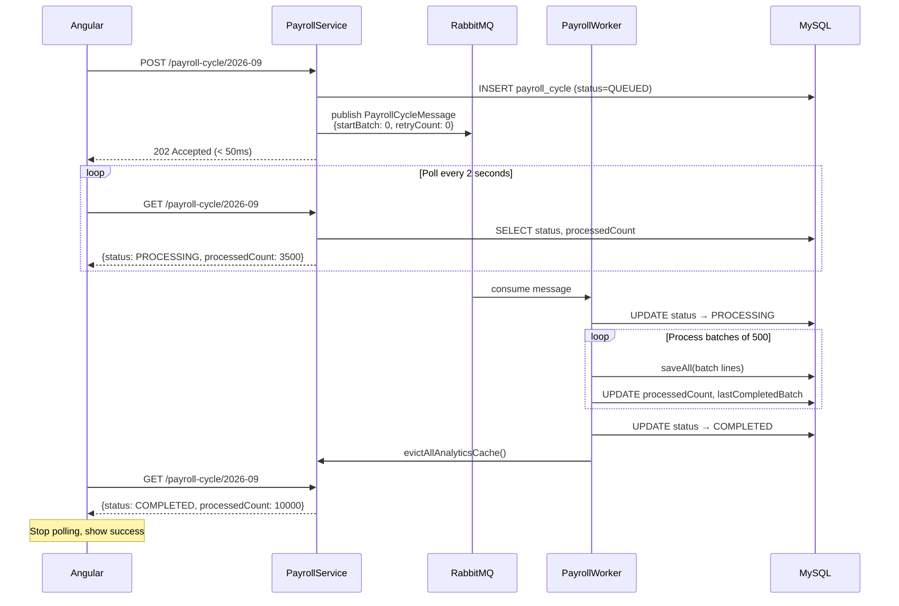
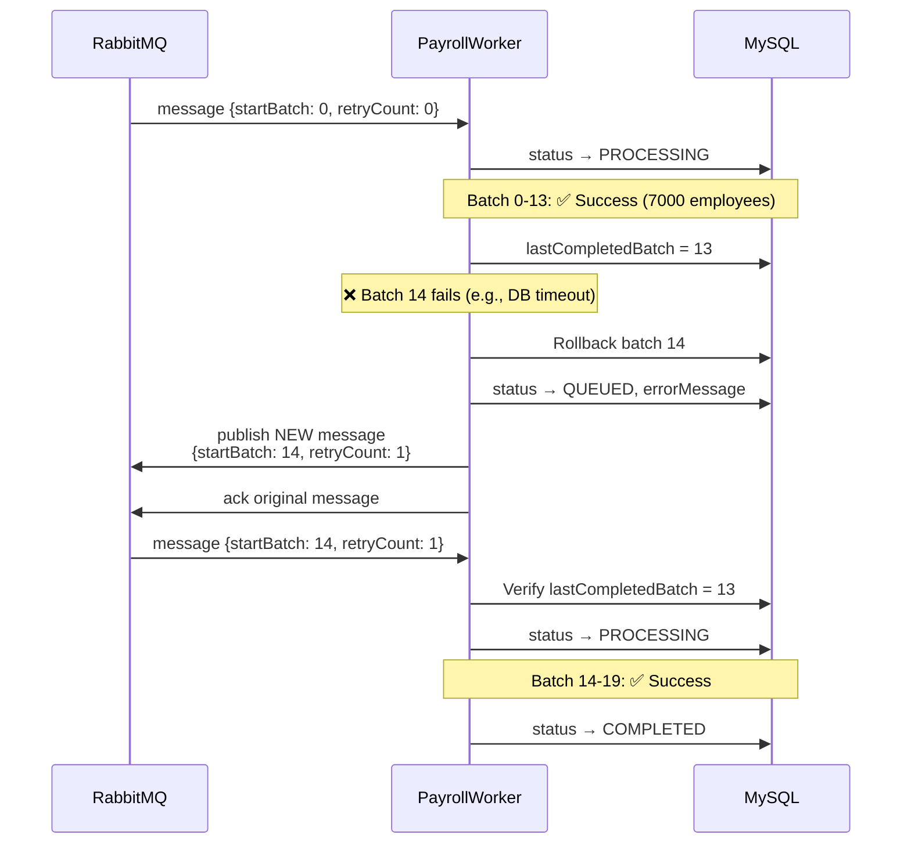
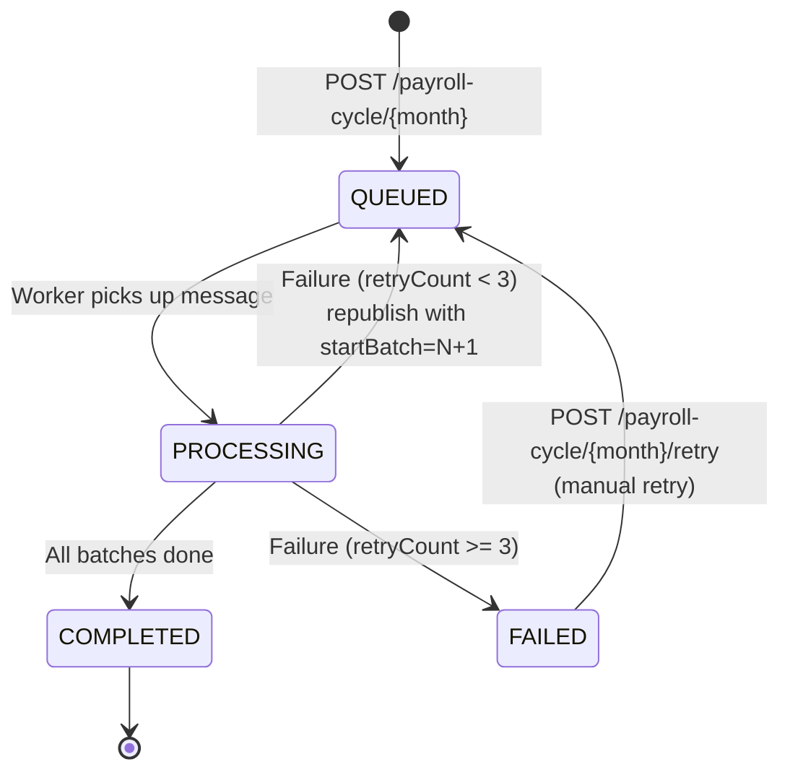
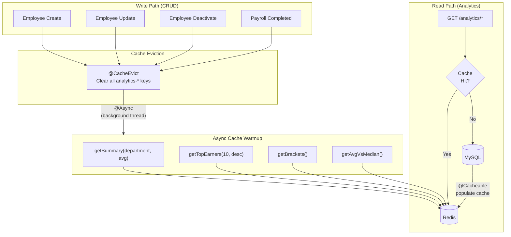
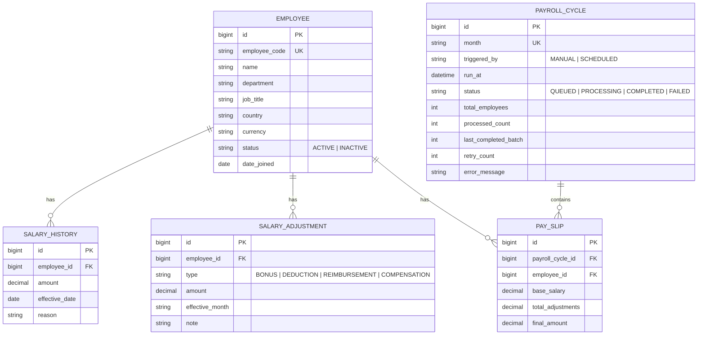
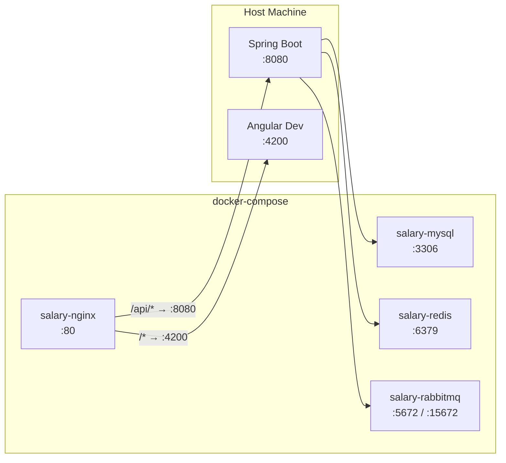

# Architecture

## Tech Stack
- **Backend:** Java 21 + Spring Boot (Web, Data JPA, Validation, AMQP), Liquibase
- **Database:** MySQL
- **Cache:** Redis
- **Message Queue:** RabbitMQ
- **Reverse Proxy:** Nginx
- **Frontend:** Angular 19 (standalone components) + Angular Material + ngx-charts

## System Overview

## Request Flow — CRUD Operations

## Async Payroll Processing — RabbitMQ

## Payroll Batch Retry with Idempotency

## Payroll State Machine

## Redis Caching Strategy

## Data Model

## Backend Layer Architecture

```mermaid
flowchart TB
    subgraph Controllers["Controllers (@RestController)"]
        EC["EmployeeController"]
        PC["PayrollController"]
        AC["AnalyticsController"]
        SC["SeedController"]
    end

    subgraph Services["Services (@Service)"]
        ES["EmployeeService"]
        PS["PayrollService"]
        AS["AnalyticsService"]
        PP["PayrollPublisher"]
        CE["CacheEvictionService"]
        CW["CacheWarmupService"]
    end

    subgraph Worker["Worker (@Component)"]
        PW["PayrollWorker<br/>@RabbitListener"]
    end

    subgraph Repositories["Repositories (JPA)"]
        ER["EmployeeRepository"]
        SR["SalaryHistoryRepository"]
        SAR["SalaryAdjustmentRepository"]
        PRR["PayrollCycleRepository"]
        PRL["PaySlipRepository"]
        AR["AnalyticsRepository<br/>(EntityManager)"]
    end

    subgraph DTOs["DTOs / Projections"]
        Req["Request DTOs"]
        Res["Response DTOs"]
        Proj["Typed Projections"]
        Msg["PayrollCycleMessage"]
    end

    EC --> ES
    PC --> PS
    AC --> AS
    ES --> ER & SR & CE
    PS --> PRR & PRL & PP
    AS --> AR
    CE -->|"@Async"| CW
    CW --> AS
    PP -->|"RabbitMQ"| PW
    PW --> ER & SR & SAR & PRR & PRL & CE
    AR --> Proj
    SR --> Proj
    PRL --> Proj
```

## Infrastructure — Docker Compose

## Key Design Decisions

**Salary immutability:** Salary changes are INSERT-only into `salary_history`. `Employee` doesn't store a `current_salary` column — it's derived as the most recent `SalaryHistory` row per employee. This makes "how has pay evolved" queryable without a separate audit log.

**Payroll immutability:** A `PayrollCycle` + its `PaySlip` rows are a permanent snapshot. `base_salary` and `total_adjustments` are captured at run time, not recomputed later — so even if an employee's salary changes next month, last month's payroll record stays exactly as it was.

**Async payroll via RabbitMQ:** Payroll runs asynchronously — the API creates a QUEUED record, publishes to RabbitMQ, and returns 202 Accepted in <50ms. The worker processes in batches of 500, updating `processedCount` in DB so the frontend can show real progress via polling. On failure, the message is republished with `startBatch = lastCompletedBatch + 1` (max 3 retries) — no reprocessing of already-completed batches.

**Cache-aside with async warmup:** Analytics queries are cached in Redis via `@Cacheable`. On writes (employee CRUD, payroll completion), all analytics cache entries are evicted via `@CacheEvict`. A background `@Async` thread then pre-warms the 4 most common analytics queries so the next user gets a cache hit instead of a cold miss.

**Typed projections over Object[]:** Native SQL queries return typed projection interfaces (e.g., `EmployeeSalaryProjection`) instead of raw `Object[]` arrays. The `AnalyticsRepository` uses private record classes to map `EntityManager` results to projections, keeping `Object[]` confined to the repository layer.

**Dynamic filtering via Criteria API:** Employee listing supports optional search + department + country + status + jobTitle filters. The Criteria API builds WHERE clauses dynamically based on which params are present — one method handles all 32+ filter combinations.

## API Shape

| Endpoint | Method | Purpose |
|---|---|---|
| `/employees` | GET | Paginated, filterable, sortable employee list |
| `/employees/{id}` | GET | Single employee with salary history |
| `/employees` | POST | Create employee |
| `/employees/{id}` | PUT | Update employee (salary → new SalaryHistory row) |
| `/employees/{id}/deactivate` | PUT | Deactivate employee |
| `/employees/{id}/salary-history` | GET | Salary history for one employee |
| `/employees/job-titles` | GET | Distinct job titles for dropdown |
| `/employees/{id}/adjustments` | POST | Add salary adjustment |
| `/employees/{id}/adjustments` | GET | List adjustments (optional month filter) |
| `/payroll-cycle/{month}` | POST | Trigger async payroll (returns 202) |
| `/payroll-cycle/{month}` | GET | Payroll run status + progress |
| `/payroll-cycle/{month}/retry` | POST | Retry failed payroll from last batch |
| `/pay-slips/{month}` | GET | Paginated payslips with search |
| `/payroll-cycle/{month}/summary` | GET | Aggregate summary (total employees, payout, adjustments) |
| `/payroll-cycle` | GET | All payroll runs (history) |
| `/analytics/summary` | GET | Dimension × metric aggregate |
| `/analytics/top-earners` | GET | Top/bottom N ranking |
| `/analytics/brackets` | GET | Salary bracket distribution |
| `/analytics/avg-vs-median` | GET | Company-wide average vs median |
| `/seed` | POST | Generate 10K test employees |